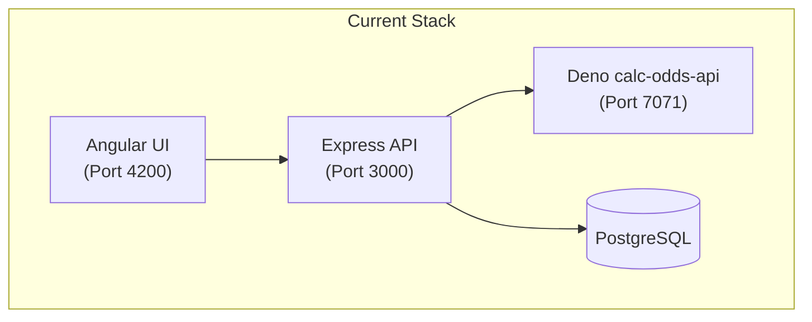
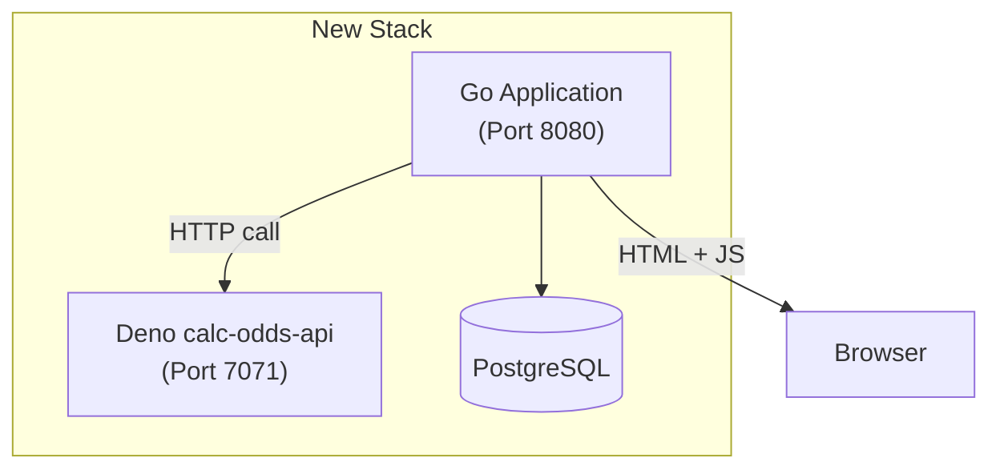

# Migration Plan: Angular/Express → Go + Vanilla JavaScript

## Overview

This plan outlines the migration of the playpokerodds project from its current
Angular frontend + Express backend architecture to a **unified Go application**
that serves both the web API and HTML templates, with **client-side vanilla
JavaScript** handling reactivity.

### Current Architecture



### Target Architecture



---

## Confirmed Decisions

- ✅ **HTTP Server**: Go standard library `net/http` (no gin/chi)
- ✅ **CSS**: Plain CSS (port existing styles)
- ✅ **calc-odds-api**: Keep as Deno microservice, migrate later
- ✅ **Infrastructure**: Same hosting setup

---

## Important Notes

> **Breaking Changes**: The entire frontend will be rewritten from Angular to
> vanilla HTML/JS. Users will experience a different (but functionally
> equivalent) UI.

> **Deno calc-odds-api Decision**: The `calc-odds-api` will remain as a separate
> Deno microservice. The Go application will call it via HTTP. This can be
> migrated to Go later if needed.

> **Database Migration**: There will be a period where the old Express API and
> new Go API cannot run simultaneously against the same database. Plan for a
> maintenance window during deployment.

---

## Proposed Changes

### Component 1: Go Application Core

A new Go application will be created to replace both the Angular UI and Express
API.

#### [NEW] main.go

- Application entry point
- HTTP server setup with routing
- Middleware registration (CORS, logging, auth)

#### [NEW] go.mod

- Go module definition with dependencies:
  - **Standard library `net/http`** for HTTP server (no external router)
  - `github.com/lib/pq` for PostgreSQL
  - `github.com/golang-jwt/jwt/v5` for JWT auth
  - `golang.org/x/crypto/bcrypt` for password hashing

---

### Component 2: Database Layer

Replace Prisma with native Go PostgreSQL driver and SQL queries.

#### [NEW] internal/db/db.go

- Database connection pool management
- Connection configuration from environment variables

#### [NEW] internal/db/models.go

- Go structs matching the current Prisma schema:

```go
type User struct {
    ID         string
    Email      string
    Username   string
    Salt       string
    Hash       string
    Score      float64
}

type Round struct {
    ID             string
    MyHand         []Card    // JSON
    OpponentsHands [][]Card  // JSON
    Board          []Card    // JSON
    Odds           float64
    Timestamp      time.Time
}

type RoundAnswer struct {
    ID        string
    Estimate  float64
    UserID    *string
    RoundID   string
    Timestamp time.Time
}

type UserFavoriteRounds struct {
    RoundID string
    UserID  string
}

type UserRole struct {
    ID        string
    Role      int
    UserEmail string
}

type Event struct {
    ID        string
    Type      string
    Payload   json.RawMessage
    Timestamp time.Time
}
```

#### [NEW] internal/db/queries.go

- SQL queries for all CRUD operations

---

### Component 3: API Routes (Go)

Port all Express routes to Go HTTP handlers.

#### [NEW] internal/handlers/auth.go

Equivalent to `src/web-api/src/routes/auth/index.ts`:

| Express Route            | Go Handler            |
| ------------------------ | --------------------- |
| `POST /auth/login`       | `LoginHandler`        |
| `POST /auth/register`    | `RegisterHandler`     |
| `GET /auth/refreshToken` | `RefreshTokenHandler` |
| `POST /auth/admin-login` | `AdminLoginHandler`   |

#### [NEW] internal/handlers/poker.go

Equivalent to `src/web-api/src/routes/poker/index.ts`:

| Express Route                             | Go Handler                       |
| ----------------------------------------- | -------------------------------- |
| `POST /poker/postNewRoundAnswer`          | `PostNewRoundAnswerHandler`      |
| `POST /poker/postExistingRoundAnswer`     | `PostExistingRoundAnswerHandler` |
| `PUT /poker/addToFavorites/:roundId`      | `AddToFavoritesHandler`          |
| `PUT /poker/removeFromFavorites/:roundId` | `RemoveFromFavoritesHandler`     |
| `GET /poker/fetchRoundById/:id`           | `FetchRoundByIdHandler`          |
| `GET /poker/fetchRound`                   | `FetchRoundHandler`              |
| `GET /poker/fetchLeaderboards`            | `FetchLeaderboardsHandler`       |
| `GET /poker/fetchRandomRound`             | `FetchRandomRoundHandler`        |
| `GET /poker/fetchEvents`                  | `FetchEventsHandler`             |

#### [NEW] internal/handlers/user.go

- User profile endpoints

#### [NEW] internal/handlers/health.go

- Liveness/readiness probes

---

### Component 4: Poker Core Logic (Go Port)

Port the TypeScript/Deno poker logic to Go.

#### [NEW] internal/poker/card.go

- Card types and utilities (port from `src/core/src/card/card.ts`)

#### [NEW] internal/poker/hand.go

- Hand evaluation logic

#### [NEW] internal/poker/round.go

- Round types and validation (port from `src/core/src/round/round.ts`)

#### [NEW] internal/poker/calculator.go

- Monte Carlo odds calculation (port from
  `src/core/src/calculate-odds/calculator/Calculator.ts`)
- Hand evaluation (port from
  `src/core/src/calculate-odds/calculator/evaluate.ts`)

---

### Component 5: HTML Templates

Go templates replacing Angular components. Templates will be served via Go's
`html/template` package.

#### [NEW] templates/base.html

- Base layout with header, navigation, and footer
- Includes CSS and JS references

#### [NEW] templates/home.html

Port of `src/ui/src/app/home/homepage.component.ts`

#### [NEW] templates/play.html

Port of `src/ui/src/app/play/play.component.ts` - main game interface

#### [NEW] templates/leaderboards.html

Port of leaderboards component

#### [NEW] templates/profile.html

Port of user profile components

#### [NEW] templates/about.html

Port of about component

#### [NEW] templates/partials/

Reusable template partials:

- `card.html` - Single card display
- `poker-table.html` - Game table layout
- `guess-box.html` - User input for odds guess
- `top-bar.html` - Navigation header
- `loader.html` - Loading spinner

---

### Component 6: Static Assets & Vanilla JavaScript

#### [NEW] static/css/styles.css

- Consolidated CSS from Angular components
- CSS custom properties (variables) for theming
- Port existing styles from `src/ui/src/styles.css`

#### [NEW] static/js/app.js

Main application JavaScript:

- Client-side routing (hash-based or History API)
- Global state management
- HTTP request helpers (fetch wrapper)

#### [NEW] static/js/components/poker-table.js

- Card rendering and animations
- Board state management
- Hand display logic

#### [NEW] static/js/components/guess-box.js

- Slider interaction for odds guessing
- Submit functionality
- Result display

#### [NEW] static/js/components/auth.js

- Login/register forms
- Token storage (localStorage)
- Session management

#### [NEW] static/js/api.js

- API client for all backend calls
- JWT token injection
- Error handling

#### [COPY] static/assets/

- Copy existing assets from `src/ui/src/assets/`
- Card images, backgrounds, icons

---

### Component 7: Docker Configuration

#### [MODIFY] docker-compose.yml

Replace multi-service setup with simplified configuration:

```yaml
services:
    app:
        build:
            context: .
            dockerfile: Dockerfile
        ports:
            - "8080:8080"
        environment:
            - DB_CONNECTION_STRING=postgresql://root:root@db:5432/gtop
            - JWT_SECRET=${JWT_SECRET}
            - CALC_ODDS_API_URL=http://calc-odds-api:7071
        depends_on:
            db:
                condition: service_healthy
            calc-odds-api:
                condition: service_started

    calc-odds-api:
        build:
            context: src/calc-odds-api
        environment:
            - ITERATIONS=50000
        ports:
            - 7071:7071

    db:
        image: postgres:16.3
        environment:
            POSTGRES_USER: root
            POSTGRES_PASSWORD: root
            POSTGRES_DB: gtop
        healthcheck:
            test: ["CMD", "pg_isready", "-d", "gtop", "-U", "root"]
            start_period: 10s
            interval: 3s
            timeout: 5s
            retries: 5
        ports:
            - "5432:5432"
        volumes:
            - ./postgres-data:/var/lib/postgresql/data

volumes:
    postgres-data:
        external: true
```

#### [NEW] Dockerfile

Multi-stage Go build:

```dockerfile
FROM golang:1.22-alpine AS builder
WORKDIR /app
COPY go.mod go.sum ./
RUN go mod download
COPY . .
RUN CGO_ENABLED=0 go build -o main .

FROM alpine:latest
COPY --from=builder /app/main /main
COPY --from=builder /app/templates /templates
COPY --from=builder /app/static /static
EXPOSE 8080
CMD ["/main"]
```

---

### Component 8: Files to Archive/Remove

These files become obsolete after migration:

| Path                 | Action                               |
| -------------------- | ------------------------------------ |
| `src/ui/`            | Archive or delete entire Angular app |
| `src/web-api/`       | Archive or delete Express API        |
| `src/calc-odds-api/` | Keep as Deno service                 |
| `src/core/`          | Archive after porting to Go          |

---

### Component 9: GitHub Actions Simplification

**Current state**: 3 separate workflows triggered by path changes on `main`:

- `client-ui-latest.yml` - Angular UI build
- `web-api-latest.yml` - Express API test + build
- `calc-odds-api.latest.yml` - Deno API build

**Target state**: Single unified workflow triggered by **git tags** for
releases.

#### [DELETE] .github/workflows/client-ui-latest.yml

No longer needed - Angular app removed.

#### [DELETE] .github/workflows/web-api-latest.yml

No longer needed - Express API removed.

#### [MODIFY] .github/workflows/calc-odds-api.latest.yml

Keep but update trigger to be part of unified release (or keep separate for
now).

#### [NEW] .github/workflows/release.yml

Unified release workflow:

```yaml
name: Release

on:
    push:
        tags:
            - "v*" # Trigger on version tags like v1.0.0
    workflow_dispatch:
        inputs:
            version:
                description: "Version tag (e.g., v1.0.0)"
                required: true

jobs:
    test:
        runs-on: ubuntu-latest
        steps:
            - uses: actions/checkout@v4

            - name: Set up Go
              uses: actions/setup-go@v5
              with:
                  go-version: "1.22"

            - name: Run tests
              run: go test ./...

            - name: Build check
              run: go build -o /dev/null ./...

    build-and-push:
        runs-on: ubuntu-latest
        needs: test
        steps:
            - uses: actions/checkout@v4

            - name: Set up Docker Buildx
              uses: docker/setup-buildx-action@v3

            - name: Log in to registry
              uses: docker/login-action@v3
              with:
                  registry: ghcr.io
                  username: ${{ secrets.CONTAINER_USERNAME }}
                  password: ${{ secrets.CONTAINER_PASSWORD }}

            - name: Extract version from tag
              id: version
              run: echo "VERSION=${GITHUB_REF#refs/tags/}" >> $GITHUB_OUTPUT

            - name: Build and push Go app
              uses: docker/build-push-action@v5
              with:
                  push: true
                  tags: |
                      ${{ secrets.REPOSITORY_NAME }}/ppo-app:latest
                      ${{ secrets.REPOSITORY_NAME }}/ppo-app:${{ steps.version.outputs.VERSION }}
                  context: .

            - name: Build and push calc-odds-api
              uses: docker/build-push-action@v5
              with:
                  push: true
                  tags: |
                      ${{ secrets.REPOSITORY_NAME }}/ppo-calc-odds:latest
                      ${{ secrets.REPOSITORY_NAME }}/ppo-calc-odds:${{ steps.version.outputs.VERSION }}
                  context: ./src/calc-odds-api
```

**Release workflow**:

1. Create and push a tag: `git tag v1.0.0 && git push origin v1.0.0`
2. Both Go app and calc-odds-api are tested, built, and pushed with matching
   version tags
3. Single atomic deployment per release

---

## Implementation Order

1. **Phase 1: Foundation** (Days 1-2)
   - Set up Go project structure and dependencies
   - Implement database connection and models
   - Create basic HTTP routing

2. **Phase 2: API Migration** (Days 3-5)
   - Port all Express routes to Go handlers
   - Implement authentication middleware
   - Port poker core logic to Go

3. **Phase 3: Frontend Migration** (Days 6-8)
   - Create HTML templates for all pages
   - Implement vanilla JS reactivity
   - Style with CSS

4. **Phase 4: Integration & Testing** (Days 9-10)
   - Manual testing of all flows
   - Docker setup and local testing
   - Performance optimization

5. **Phase 5: CI/CD & Cleanup** (Day 11)
   - Create unified GitHub Actions release workflow
   - Delete obsolete workflow files
   - Archive legacy Angular/Express code
   - Tag first release: `git tag v1.0.0 && git push origin v1.0.0`

---

## Verification Plan

### Automated Tests

```bash
# Run Go unit tests
go test ./...

# Run integration tests with test database
docker compose up --build

# API endpoint testing with curl
./scripts/test-api.sh
```

### Manual Verification

| Feature        | Test Steps                                   |
| -------------- | -------------------------------------------- |
| Homepage       | Navigate to / and verify demo gif loads      |
| Play game      | Click "Play now", verify poker table renders |
| Submit answer  | Enter odds guess, submit, verify result      |
| Authentication | Register, login, verify token stored         |
| Leaderboards   | Navigate to /leaderboards, verify data loads |
| Profile        | Login, go to /profile, verify user data      |
